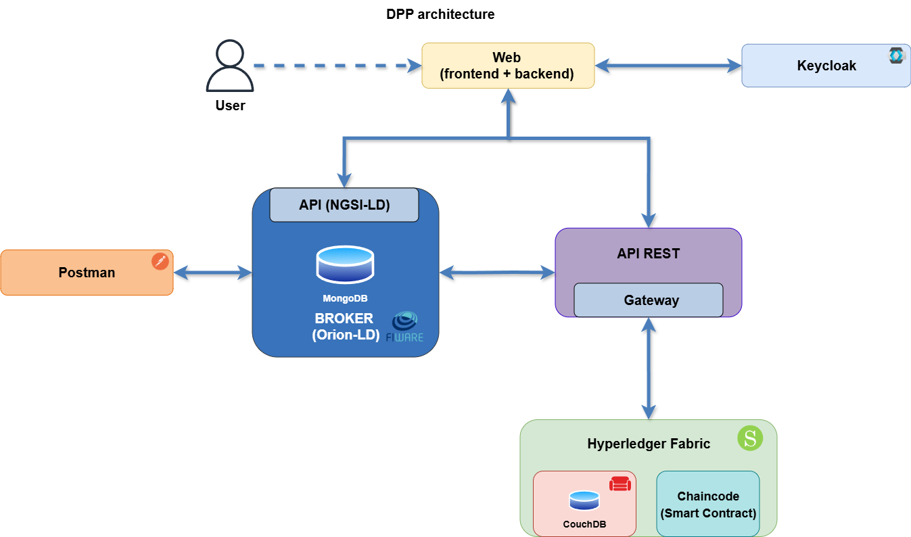
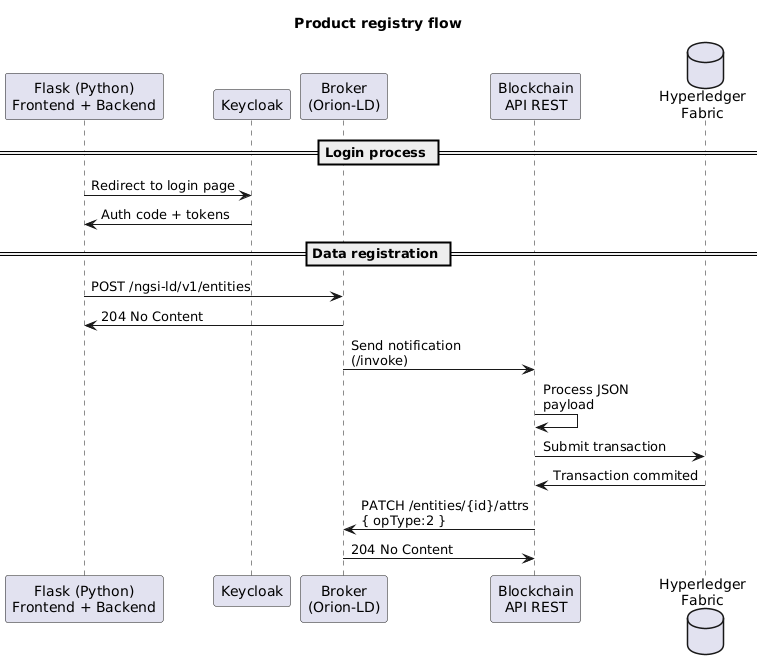
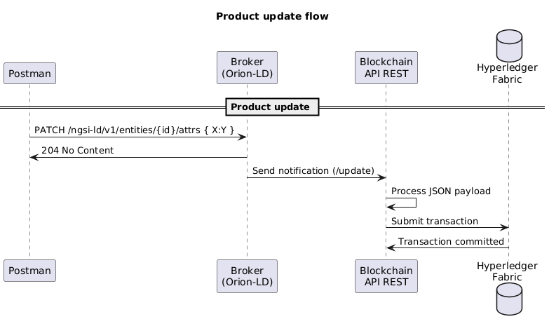
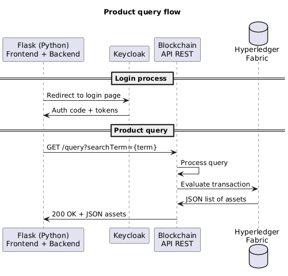

# UniMaaS - Digital Product Passport (DPP)

## Overview

Digital Product Passport (DPP) is a solution designed to enable secure, verifiable, and interoperable digital product passports in compliance with upcoming EU regulations. The DPP facilitates tracking, registration, and querying of product information across supply chains. The architecture of the solution can be seen on the next figure:

  

### Register flow

The registration flow enables manufacturers and suppliers to create and register a new digital product passport. The flow can be seen on the next sequence diagram:

  

### Update flow

The update flow allows authorized users to update product attributes during its lifecycle. The flow can be seen on the next sequence diagram:

  

### Query flow

The query flow allows authorized users to retrieve DPP data for a given product. The flow can be seen on the next sequence diagram:

  

## Deployment

### Requirements

**The following are essential requirements - these must be in place before proceeding:**

- Docker & Docker Compose
- Blockchain with UniMaaS chaincode + API REST already deployed
- Postman (to update DPP product information)
- [.env](.env) file properly configured

### Steps

1. Clone the repository:
   ```bash
   git clone https://gitlab.odins.es/101177842-unimaas/dpp
   cd dpp
   ```

 2. Configure environment variables by editing the `.env` file.
 
 3. Start the services:
    ```bash
    docker-compose up -d --build
    ```

    and track them with:

    ```bash
    docker-compose logs -f <service>
    ```
 4. Create the subscriptions in Orion-LD (use the [Postman collection](./UniMaaS%20-%20DPP.postman_collection.json)) - the Blockchain needs Orion-LD notifications to create/update products.
 5. Access the DPP frontend at https://localhost:PORT (replace PORT accordingly, by default, 8080) to register and view DPPs.
 6. Update product information through Orion-LD endpoints (again, you can use the [Postman collection](./UniMaaS%20-%20DPP.postman_collection.json) to it).

### Environment variables

The following environment variables are used to configure the Digital Product Passport. Make sure to update the `.env` file accordingly before deploying. Please, execute the following command to create a valid `.env` file.

```bash
cp .env.example .env
```

#### Network configuration

| Variable         | Description                              | Default example |
| ---------------- | ---------------------------------------- | --------------- |
| `NETWORK_PREFIX` | Network subnet prefix for Docker network | `172.25.0`      |

#### MongoDB configuration

| Variable              | Description                     | Default example |
| --------------------- | ------------------------------- | --------------- |
| `MONGO_VERSION`       | MongoDB Docker image version    | `4.4`           |
| `MONGO_INTERNAL_PORT` | MongoDB internal container port | `27017`         |
| `MONGO_EXTERNAL_PORT` | MongoDB exposed host port       | `27017`         |
| `MONGO_HOSTNAME`      | MongoDB container hostname      | `mongo`         |

#### FIWARE Orion-LD configuration

| Variable              | Description                   | Default example |
| --------------------- | ----------------------------- | --------------- |
| `ORION_VERSION`       | FIWARE Orion version          | `1.9.0`         |
| `ORION_INTERNAL_PORT` | Container internal port       | `1026`          |
| `ORION_EXTERNAL_PORT` | Exposed port on host          | `1026`          |
| `ORION_HOSTNAME`      | Orion container hostname      | `orion`         |
| `ORION_PROTOCOL`      | Protocol used to access Orion | `http://`       |

#### Web configuration

| Variable                | Description                           | Default example                    |
| ----------------------- | ------------------------------------- | ---------------------------------- |
| `WEB_PROTOCOL`          | Protocol used by the frontend         | `https://`                         |
| `WEB_INTERNAL_HOSTNAME` | Hostname inside Docker network        | `localhost`                        |
| `WEB_HOSTNAME`          | Container hostname                    | `web`                              |
| `WEB_INTERNAL_PORT`     | Internal port inside Docker           | `5000`                             |
| `WEB_EXTERNAL_PORT`     | Exposed port on host machine          | `8080`                             |
| `WEB_SECRET_KEY`        | Secret key for session or JWT         | `e07fb630212d1ec1935c6900148a7067` |
| `WEB_DEBUG`             | Debug mode flag (0 = false, 1 = true) | `1`                                |

#### Keycloak configuration

| Variable                   | Description                            | Default example  |
| -------------------------- | -------------------------------------- | ---------------- |
| `KEYCLOAK_VERSION`         | Keycloak Docker image version          | `26.2.4`         |
| `KEYCLOAK_PROTOCOL`        | Protocol to access Keycloak            | `https://`       |
| `KEYCLOAK_HOSTNAME`        | Keycloak container hostname            | `keycloak`       |
| `KEYCLOAK_PUBLIC_HOSTNAME` | Hostname to access Keycloak externally | `localhost`      |
| `KEYCLOAK_INTERNAL_PORT`   | Internal container port                | `8443`           |
| `KEYCLOAK_EXTERNAL_PORT`   | Exposed port on host                   | `8443`           |
| `KEYCLOAK_ADMIN`           | Admin username                         | `admin`          |
| `KEYCLOAK_ADMIN_PASSWORD`  | Admin password                         | `admin`          |
| `KEYCLOAK_CLIENT_ID`       | OAuth2 client ID                       | `unimaas`        |
| `KEYCLOAK_CLIENT_SECRET`   | OAuth2 client secret                   | `(example secret)` |
| `KEYCLOAK_REALM`           | Keycloak realm                         | `master`         |
| `KEYCLOAK_CERT`            | Path to Keycloak TLS certificate       | `keycloak.crt`   |
| `KEYCLOAK_KEY`             | Path to Keycloak TLS key               | `keycloak.key`   |

#### API REST configuration

| Variable            | Description                  | Default example |
| ------------------- | ---------------------------- | --------------- |
| `API_PROTOCOL`      | Protocol used by API REST    | `http://`       |
| `API_HOSTNAME`      | API REST container hostname  | `api`           |
| `API_INTERNAL_PORT` | Internal port in Docker      | `3002`          |
| `API_EXTERNAL_PORT` | Exposed port on host machine | `3002`          |


## Use Guide

### 0. Register client in Keycloak

- Access `https://localhost:8443` (Please check if this port correspond with your deployment, if not, change it accordingly)
- Clients -> Create Client -> Add 'unimaas' as Client ID (to match the client defined in the `KEYCLOAK_CLIENT_ID` environment variable from `.env` file, if modified, please change accordingly) -> Name and description fields are optional -> Next -> Turn on 'Client Authentication' -> Next -> Add `https://localhost:8080/*` and `https://[YOUR_IP]:8080/*` in `Valid redirect URIs` and in `Valid post logout redirect URIs` -> Save
- Once created, go to Clients -> unimaas (or the name you established for the client you just created) -> Credentials -> Copy Client Secret -> Update the `KEYCLOAK_CLIENT_SECRET` environment varibale from the `.env` file -> Save changes

### 1. Access and authentication

- Access the DPP frontend at `https://localhost:PORT` (default port: 8080).  
- Log in or register via Keycloak.  
- Only authorized users can register, *update* **(WIP)**, or query product data.

### 2. Registering a new product

- Navigate to the product registration page in the frontend.  
- Fill in the required product information fields.  
- Submit the form to create a new Digital Product Passport entry.

### 3. Querying product information

- Use the search interface to retrieve product details by its attributes.

### 4. Updating product attributes (WIP)

**WARNING:** *Currently, product updates via FIWARE Orion-LD broker are a work in progress. Be cautious when updating product data through the broker, as it is not fully secured yet.*
- Import the provided Postman collection to interact with the Orion-LD endpoints and manage subscriptions and entities.

## Troubleshooting

### Restarting Services

If any service is not responding or behaving unexpectedly, you can restart all services with:

```bash
docker-compose restart
```

To stop all services:

```bash
docker-compose down
```

To start services again:

```bash
docker-compose up -d
```

### Common Issues

* **Ports already in use:** Ensure the ports specified in `.env` are free or change them.
* **Environment variables missing or misconfigured:** Double-check the `.env` file for correct values.
* **Blockchain chaincode not deployed:** Verify that the UniMaaS chaincode is correctly installed and instantiated.
* **Keycloak login issues:** Confirm Keycloak service is running and reachable at the configured hostname and port.

If issues persist, check logs with:

```bash
docker-compose logs -f
```

Or inspect individual container logs:

```bash
docker-compose logs -f <service-name>
```
